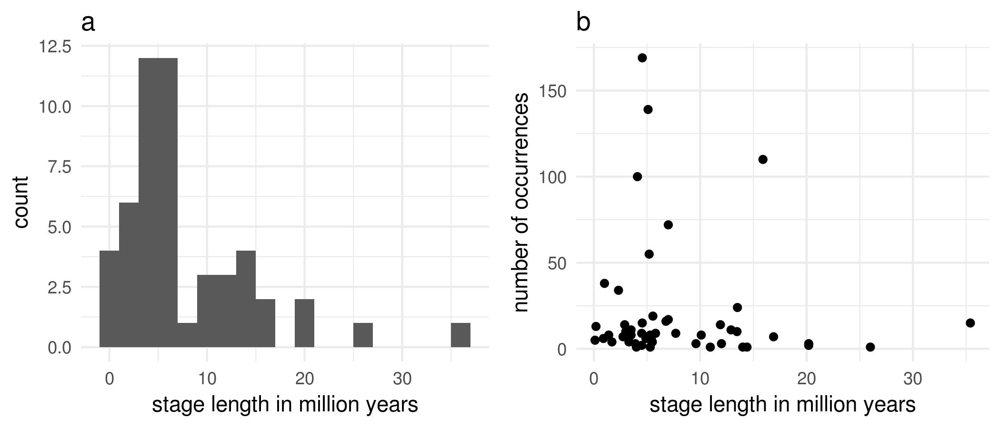
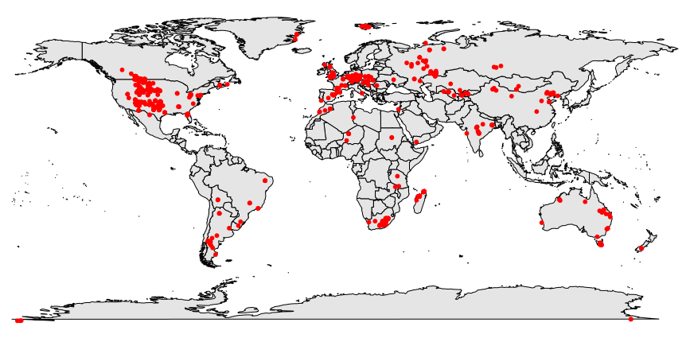
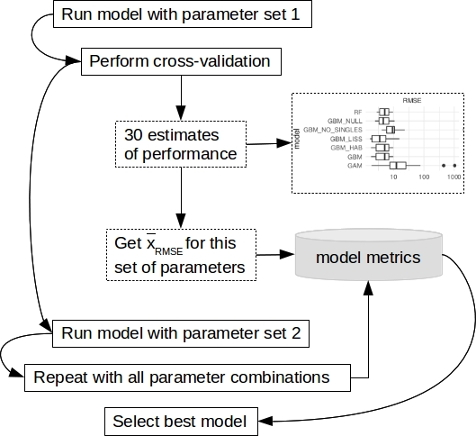

```{r setup, include=FALSE}
rm(list = ls()) # clear your workspace!

# warnings on/off
oldw <- getOption("warn")
options(warn = -1)
library(knitr)

knitr::opts_chunk$set(echo = FALSE, warnings=FALSE, message = FALSE, fig.path="figures_supp/", dev=c("pdf"))

library(ggplot2) # plots
library(gridExtra) # multipanel plots
library(grid) # multipanel plots
library(gsubfn) # rename levels
library(captioner) # for writing captions
library(mice) # needed for the imputation plot to work
library(reshape) # need melt function for plots
library(randomForest)
library(gbm) # general boosted model

# packages from data processing R-script
library(scales)
library(fields)
library(rgdal)

# packages from model building R-script
library(mgcv)
library(caret)
library(simpleboot)

theme=theme_set(theme_minimal()+
                theme(axis.text=element_text(size=7),
                      axis.title=element_text(size=9))) 

# Captions setup

table_name <- captioner(prefix="Table S", auto_space = FALSE) # define caption type supplementary table
figure_name <- captioner(prefix="Figure S", auto_space = FALSE) # define caption type supplementary figure
output <- captioner(prefix="Output ", auto_space = FALSE) # define caption type model output

  ## Figure captions:
figure_name(name="stratplots", "Stratigraphic resolution of the fossil data. Panel a) shows a histogram of the stage lengths (n=51). Panel b) shows the number of occurrences in each stage.")
figure_name(name="occurrence_map", "A map of all amphibian fossil occurrences used in the analysis.")
figure_name(name="latitudinal_comparison", "Boxplot showing the mean latitude of each living and fossil species. Boxplot width is scaled to sample size of each group (living: 1382, paleo: 354).")
figure_name(name="algorithms",  "Convergence of the MICE algorithm for body size and abundance. Plotted are the mean and standard deviations of the imputed values per iteration. svl = body size, abu_cat = abundance. For variable explanation see Tab. S1.")
figure_name(name="density_imputation",  "Kernel density estimates of the observed data (blue) and the m=50 densities per variable calculated from the imputed data (red lines) using the MICE algorithm (panel a) and b) and the randomForest algorithm (c and d).")
figure_name(name="imputated_percent",  "Imputated values in each taxonomic group. Blue color indicates the imputed values. Panel a) shows histograms of the body size in mm, panel b) shows the abundance category data.")
figure_name(name="flowchart_model_selection",  "Model selection process, depicted as flowchart. Each model type (GAM, rF and GBM) was fitted using cross-validation. The model performance metrics were collected for each parameter set, finding the best parameter setting for the model.")
figure_name(name="RMSE_rf", "Root mean squared error (RMSE) for each cross validation set of different parameters mtry (number of predictor to chose from at each split in the random Forest).")
figure_name(name="VarImpPlot", "Variable importance measures for the final randomForest. Left plot: Difference in percent between the prediction error (mean squared error (MSE)) of the model and the prediction error after permuting each variable while holding all other data constant (%IncMSE). Differences are normalized by the standard deviation of the differences. Right plot: The total decrease in node impurity from splitting on the variable, averaged over all trees, measured by residual sum of squares (IncNodePurity). Variable names on the y-axis are the variables as used in the model and explained in Table S1.")
figure_name(name="performance_gbm", "Relationship between the Root-mean-squared error (RMSE) of the GBM as estimate of performance and the tuning parameters: minimum terminal node size (vertical panels), shrinkage (horizontial panels) and maximum tree depth (legend). Minimum terminal node size defines the minimum number of observations in the trees terminal nodes, shrinkage is the learning rate of the model, maximum tree depth is the interaction depth for variables, with 1 being an additive model.")
figure_name(name="VarImp_gbm", "Variable importance for the final GBM.")
figure_name(name="scatter_plots", "Scatterplots of each prediction variable with the response variable for the fossil species data. Variables are described in detail in Table S1.")
figure_name(name="taxo_bias", "Durations of fossil species as histogram in the main taxonomic groups (a) and as histogram (b). Number of species per group are: Allocaudata (11), Lepospondyli (39), Parabatrachia (2), Salientia (80), Tenmospondyli (175),  Urodela (39).")
figure_name(name="taxo_adjust", "Predicted species durations plotted against observed durations for each taxonomic group. Results are for n=500 repetitions in which the data was randomly split into calibration and test dataset. The blue curve is a generalized additive model with default settings used in geom_smooth() of the ggplot2 package, the grey areas are 95% confidence intervals for the gam. The dashed line is a line through the origin with a slope of 1.")
figure_name(name="liss_performance", "Relative influence of each variable for the final Lissamphibia GBM. The relative influence is an importance measure for the influence of each predictor variable in the model. Values are scaled to match 100%. Variables are described in detail in Table S1.")
figure_name(name="nosingles_performance", "Relative influence of each variable for the no-single-interval species GBM. The relative influence is an importance measure for the influence of each predictor variable in the model. Values are scaled to match 100%. Variables are described in detail in Table S1.")
figure_name(name="performance_gbm.null", "Relationship between the Root-mean-squared error (RMSE) of the GBM as estimate of performance and the tuning parameters: minimum terminal node size (vertical panels), shrinkage (horizontial panels) and maximum tree depth (legend). Minimum terminal node size defines the minimum number of observations in the trees terminal nodes, shrinkage is the learning rate of the model, maximum tree depth is the interaction depth for variables, with 1 being an additive model.")
figure_name(name="null_bootstrap", "Null GBM bootstrap summaries. A) shows the RMSE values of all 50 null models, b) shows the maximum R² in each null model fitting, c) shows the predicted medium durations for the IUCN Red List categories of all 50 null models. The blue lines depict the corresponding values for RMSE and R² from the full GBM.")
figure_name(name="model_comparison", "Model performance distributions for the final model cross validation. Each model configuration is tested in a 3 times 10-fold cross validation procedure, the results are displayed here. Sample size is n=30 for each distribution, in accordance with the 3 times 10-fold cross validation procedure. The final model is chosen based on the mean RMSE values of these distribution. RF = randomForest, GBM_NULL = GBM Null model, GBM_NO_SINGLES = GBM without single interval species, GBM_NO_IMP = GBM on data without imputation, GBM_LISS = GBM on Lissamphibia only, GBM = Generalized boosted model, GAM = Generalized additive model.")
figure_name(name="predictions_all", "Predicted durations of living species based on all build models. Note that the predicted durations of the GAM have been square-root transformed for better visibility, as the range of durations was much larger than for the other models. GBM = Generalized boosted model, GBM-NO_IMP = GBM on data without imputation, GBM_NULL = GBM Null model, GAM = Generalized additive model, RF = randomForest, GBM_LISS = GBM on Lissamphibia only, GBM_NO_SINGLES = GBM without single interval species, GBM-CORR = GBM with taxonomic bias correction (Fig. S14).")
#figure_name(name="misclassifications", "")

  ## Table caption:
table_name(name="variables_extinct", "Variable description for extinct species.")
table_name(name="tab0", "Summary statistics for the number of occurrences per species.")
table_name(name="tab1", "Keywords for text mining the abundance information of the IUCN Red List webpage for living amphibian species.")
table_name(name="tab_imputed_percent", "Percent imputed values in each taxonomic group and variable.")
table_name(name="model_comp", "Model comparison. The average RMSE (Root mean squared error) and R² including their standard deviations (SD) associated with the optimal tuning parameters across the resamples from cross validation. N=30 for each model, like in Fig. S19.")
table_name(name="misclassifications", "Number of potentially misclassified species in the IUCN Red List. Misclassifications were defined as statistical outliers, as seen in the prediction boxplots (Fig. 3).")

```


# Intro
This document contains supplementary figures S1-`r figure_name("predictions_all", display="num")`, tables S1-`r table_name("misclassifications", display="num")`, model output files and results from Kruskal-Wallis rank sum tests as well as Pairwise Wilcoxon rank sum tests. 
It is writen with the knitr package [@knitr1; @knitr2; @knitr3] for the R statistical environment [@RCoreTeam2017]. The entire analysis can be recreated by running knitr::knit() on the Markdown file *ELEtietjeSA1.Rmd*. The necessary files are available in the Git repository: https://github.com/Eryops1/supplement_amphibian_extinction_risk.

We used `r R.version.string` and the following packages:

```{r, echo=TRUE}
loadedNamespaces()
```


```{r, include=FALSE}
load("Tietje_Roedel_2017_model_prediction_workspace.RData")
# load(url("https://raw.githubusercontent.com/Eryops1/supplement_amphibian_extinction_risk/master/Tietje_Roedel_2017_model_prediction_workspace.RData"))
```


\newpage
# Data collection

## Extinct species data
`r table_name("variables_extinct")`

| Variable  | Description                                                                   |
|-----------|:------------------------------------------------------------------------------|
| Duration  | Duration of a species in the fossil record in million years. Time between the midranges of the oldest and youngest chronostratigraphic stage the species was observed, rounded to the next million years.                         | 
| Abundance | Four categories for abundance were build based on the minimum number of individuals (MNI) and specimen counts for each species. MNI and specimen count data were obtained from the PBDB or literature. Maximum values were calculated per locality and stage. The final values for each species represent the maximum value ever shown by one species over space and time. These maximum values per species were clustered via k-means clustering into four numeric, ordinal categories (1, 2, 3 and 4). K-means clustering is a 1-n dimensional approach which tries to minimize the sum of squares within each cluster, that is the distance between the points and the center of each cluster. This is accomplished by repeatedly and randomly setting the position of the centers in the 2-dimensional space, searching for the optimal solution [@harting1979]. MNI and specimen counts are the two dimensions used in this clustering. |
| Geographic range | Geographic range size is calculatd as maximum great circle distance (shortest connection between two points on the surface of a sphere). Great circle distances were calculated for each species in each stage. The maximum values ever achieved by a species is used. |
| Latitudinal range | Maximum latitudinal range of a species (maximum difference between paleolatitudes). Ranges were calculated for each species in each stage. The maximum values ever achieved is used. |
| Mean latitude | Mean latitude calculated from all fossil occurrence coordinates of each species.          |
| Minimum latitude | Minimum latitude calculated from all fossil occurrence coordinates of each species.    |
| Body size       | Maximum snout-vent-length (SVL) of the species. We collected SVL whenever possible, if not available we collected total length (TL) and absolute skull length (ASL). To estimate the SVL from TL and ASL, we created linear regressions that connect SVL, TL and ASL for species where all or at least two measurements were available. These linear models were used to calculate the SVL for species from TL or ASL. When measures on body size where not available, we used the bodysize of a congeneric species.                |


### Stratigraphic resolution



`r figure_name(name="stratplots")`

### Extinct species data summary 
`r table_name("tab0")`

| Variable  | Value                                |
|-----------|:-------------------------------------|
| Average number of occurrences per species |  2.44|
| Minimum number of occurrences per species |  1   |
| Maximum number of occurrences per species |  116 |



`r figure_name(name="occurrence_map")`


```{r latitude_comp, fig.width=3, fig.height=3}
latitude_comp_living_fossil
```

`r figure_name(name="latitudinal_comparison")`

## Living species data
### Abundance data
`r table_name("tab1")`

| Category        | Keywords                   | Conditioning  |
| --------------- |:---------------------------| :-------------|
| 1               | Not common, fewer than, rare, uncommon, small, small population, not abundant |  |
| 2               | Fairly abundant,  fairly common, moderately abundant       |  |
| 3               | Abundant, common, large, large populations | Has to be assigned first to allow for replacement in cases of "not common" or similar combinations  |
| 4               | Very abundant, very common |                |

IUCN red list population description get scraped for keywords. All keywords were saved for each species. Keywords were categorized and species assigned according to their keywords. In cases of more than one possible assignment, the species gets assigned to the highest category to account for descriptions of species which are uncommon in xyz, but have large popuations in suitable habitats. 


\newpage
# Data imputation 

Multivariate imputation by chained equations creates multiple imputed datasets depending on different sampling sets of the other available variables, and takes the mean of these imputed datasets as finally imputed value. In multiple steps, plausible values are being drawn from a conditional density distribution that is modelled for each incomplete variable. Imputed variables subsequently enter the next imputation step. For full details on the algorithm behaviour see @VanBuuren2011. We chose this data imputation method because it allows for chosing different imputation models for each variable types, as the body size is a continuous numeric variable, the abundance however is implemented as a factor, coded as integer. The mice package allows for this distinction.

The goal of our data imputation was to be able to use the maximum number of occurrences while adding a minimum of noise in the data. The potential influences of data imputation is difficult to analyse, as the missing data cannot be recovered. @hunt2017 however show, by randomly deleting variables from a complete dataset and completing it again with imputation, that using various multiple data imputation methods achieve around 80% or higher correct classifications in datasets with two or three different classes. This percentage was independant of the proportion of missing values in the data (10 to 50%). We thus assume our imputation method to be comparably effective.


## Technical details
The R Code for the data imputation can be found in *Tietje_Roedel_2017_model_building_and_prediction.R*.

We used the mice::mice() function with settings maxit=20, m=50 and methods "rf" for body size and "polr" for abundance categories. For comparison with an alternative data imputation method, we are also imputed data using the rf::rfImpute() function.
Following @VanBuuren2011 we ran diagnostic checks on the imputed data by checking for convergence of the imputing algorithms, plausibility of imputed data, and occurrences of impossible data. The results are shown in the following figures.


```{r missing data summary, include=FALSE}
# Analyse the conditions for multiple imputation
summary(extinct)
describe(extinct$svl)
hist(extinct$svl[extinct$svl<300], breaks=20)
describe(extinct$abu_cat)
table(extinct$abu_cat)
## both variables show no normal distribution

# Mark imputed data 
svl_imputed <- is.na(extinct$svl)
abu_cat_imputed <- is.na(extinct$abu_cat)
extinct.imp <- cbind(extinct.imp, svl_imputed, abu_cat_imputed) 
```

\newpage
```{r, fig.height=3.5}
plot(imputed, layout = c(2,2))
```

`r figure_name("algorithms")`

Plausibility of the imputed values was checked by comparing density plots of imputed and observed values.


```{r, fig.height=3.5}
a=ggplot(melt(imputation_mice_svl), aes(x=value))+
  geom_density(aes(group=variable, col="orange"), show.legend = FALSE)+
  geom_density(data=extinct.raw, aes(x=svl), col="blue")+
  xlab("body size")
b=ggplot(melt(as.matrix(imputation_mice_abu)), aes(x=value))+
  geom_density(aes(group=X2, col="orange"), show.legend = FALSE)+
  geom_density(data=extinct.raw, aes(x=as.numeric(as.character(extinct.imp$abu_cat))), col="blue")+
  xlab("abundance")
c=ggplot(melt(imputation_rf_svl), aes(x=value))+
  geom_density(aes(group=X2, col="orange"), show.legend = FALSE)+
  geom_density(data=extinct.raw, aes(x=svl), col="blue")+
  xlab("body size")
d=ggplot(melt(imputation_rf_abu), aes(x=value))+
  geom_density(aes(group=X2, col="orange"), show.legend = FALSE)+
  geom_density(data=extinct.raw, aes(x=as.numeric(as.character(extinct.imp$abu_cat))), col="blue")+
  xlab("abundance")

# add labeling and titles
a <- a+ggtitle("a")
b <- b+ggtitle("b")
c <- c+ggtitle("c")
d <- d+ggtitle("d")
grid.arrange(a,b,c,d, ncol=2)
```

`r figure_name("density_imputation")`

Imputed and observed values for body size and abundance in each group are shown in the following figures.

```{r, fig.height=6, fig.width=8}
a.imp=ggplot(extinct.imp[is.na(extinct.imp$order)==FALSE,], aes(svl, fill=svl_imputed))+
  geom_histogram()+
  scale_fill_hue("body size")+
  xlab("body size (mm)")+
  theme(legend.position="none")+
  facet_grid(order ~ .)
b.imp=ggplot(extinct.imp[is.na(extinct.imp$order)==FALSE,], aes(abu_cat, fill=abu_cat_imputed))+
  geom_bar()+
  scale_fill_hue("imputed")+
  xlab("abundance category")+
  facet_grid(order ~ .)

a.imp <- a.imp+ggtitle("a")
b.imp <- b.imp+ggtitle("b")
grid.arrange(a.imp, b.imp, ncol=2)

```

`r figure_name("imputated_percent")`


`r table_name("tab_imputed_percent")`
```{r, echo=FALSE}
a <- which(is.na(extinct$svl))
b <- which(is.na(extinct$abu_cat))

invisible(length(union(a,b))/nrow(extinct)) # number of occurrences with missing variable(s)
invisible(length(intersect(a,b))/nrow(extinct)) # number of occurrences with both variables missing

kable.df <- data.frame(
body_size=round(tapply(extinct.imp$svl_imputed, extinct.raw$order, sum)/
        tapply(extinct.imp$svl_imputed, extinct.raw$order, length),2),
abundance=round(tapply(extinct.imp$abu_cat_imputed, extinct.raw$order, sum)/
        tapply(extinct.imp$abu_cat_imputed, extinct.raw$order, length),2))
kable.df <- rbind(kable.df, data.frame(row.names = "Total", body_size=length(a)/nrow(extinct), abundance=length(b)/nrow(extinct)))

kable(round(kable.df,2), format = "markdown", col.names = c("body size", "abundance"))
```

## Imputation summary
Of all occurrences, `r round(length(union(a,b))/nrow(extinct)*100)`% had some missing data, while only `r round(length(intersect(a,b))/nrow(extinct)*100)`% of occurrences were missing both body size and abundance measure.
Imputed values for the two incomplete variables body size and abundance made up `r round(length(b)/nrow(extinct)*100)`% and `r round(length(a)/nrow(extinct)*100)`% of those two variables, respectively. Those proportions varied between the taxonomic groups, with Allocaudata showing the highest and Salientia the lowest proportions of imputed data (Fig. S6, Tab. S4). The quality control showed that density plots of observed and imputed values were highly comparable (Fig. S5 a and b). Further, we did not find any impossible values (like negative body size) in the imputed data. Therefore, the quality check suggests that the imputed data is likely reasonable [@VanBuuren2011].


<!--The partly imputation of our data adds additional uncertainties to the values, however we are confident that the advantages of this practice outweigh the problems. -->The imputation increased the sample size (number of occurrences we were able to ues in the model) by `r round((1-nrow(na.omit(extinct.raw))/nrow(imp))*100)`%, which added to the stability of the model. Additionally, the imputed values were restricted to the variables abundance and body size, which were of lower importance for the final model. Therefore the influence of uncertainties introduced by data imputation on the outcome of the model should have been rather small. This was also reflected by the minor differences between the GBM fitted on imputed and unimputed data (Fig. S19, S20, Tab. S5).


\newpage
# Model selection

Due to the nature of the dataset (high skewness and kurtosis of the variables) we applied three different models to our data to connect traits with the duration of species: Generalized additive model (GAM), randomForest (rF), and Generalized boosted model (GBM). 

The process of selecting the best parameter settings for the models as done in the caret package [@caret-package] is illustrated in the following Fig. S7:



`r figure_name("flowchart_model_selection")`

## Generalized additive model
Before adjusting the model parameters, we checked if logging the skewed variables in the extinct species data results in a better model performance (using default settings). While logging positively influenced the GAM fitted to the original dataset including missing values (which simply removes all cases with missing data), it only slighty influenced the GAM fitted on the imputed dataset. We therefore decided to stick to the unlogged, imputed dataset for further modelling.

A generalized additive model was fitted to the extinct species dataset using the caret::train() function. We used 3 separate 10-fold cross validations, meaning the extinct species-dataset was randomly split into 10 equal sized subsamples, from which 9 subsamples were used as training data and one was retained as validation data for testing the model. This process was repeated until each of the subsamples was used once as validation set. The procedure was repeated 3 times. 

```{r, include=FALSE}
output(name="caret_gam", "Console output fitting the gam using caret::train() function.")
```

`r output("caret_gam")`
```{r}
options(max.print = 50)
gamTrain
```

```{r, include=FALSE}
output(name="caret_gam_final", "Console output for the final gam.")
```

`r output("caret_gam_final")`
```{r}
summary(gamTrain$finalModel)
```


## Random Forest
A Random Forest model was fitted to the extinct species dataset using the caret::train() function. We used 3 separate 10-fold cross validations, meaning the extinct species-dataset was randomly split into 10 equal sized subsamples, from which 9 subsamples were used as training data and one was retained as validation data for testing the model. This process was repeated until each of the subsamples was used once as validation set. The procedure was repeated 3 times. 

```{r, include=FALSE}
output(name="caret_rf", "Console output fitting the rF using caret::train() function.")
```

`r output("caret_rf")`
```{r}
options(max.print = 50)
rfFit1
```

```{r, include=FALSE}
output(name="caret_rf_final", "Console output for the final rF.")
```

`r output("caret_rf_final")`
```{r}
rfFit1$finalModel
```

   

```{r, fig.height=3, fig.width=4}
ggplot(rfFit1)
```

`r figure_name("RMSE_rf")`


```{r, fig.height=3}
varImpPlot_mod <- function(x, sort = TRUE, n.var = min(30, nrow(x$importance)), 
    type = NULL, class = NULL, scale = TRUE, main = deparse(substitute(x)), 
    ...) 
{
    if (!inherits(x, "randomForest")) 
        stop("This function only works for objects of class `randomForest'")
    imp <- importance(x, class = class, scale = scale, type = type, 
        ...)
    if (ncol(imp) > 2) 
        imp <- imp[, -(1:(ncol(imp) - 2))]
    nmeas <- ncol(imp)
    if (nmeas > 1) {
        op <- par(mfrow = c(1, 2), mar = c(4, 5, 2, 1), mgp = c(2, 
            0.8, 0), oma = c(0, 0, 0, 0), no.readonly = TRUE)
        on.exit(par(op))
    }
    for (i in 1:nmeas) {
        ord <- if (sort) 
            rev(order(imp[, i], decreasing = TRUE)[1:n.var])
        else 1:n.var
        xmin <- if (colnames(imp)[i] %in% c("IncNodePurity", 
            "MeanDecreaseGini")) 
            0
        else min(imp[ord, i])
        dotchart(imp[ord, i], xlab = colnames(imp)[i], ylab = "", 
            main = if (nmeas == 1) 
                main
            else NULL, xlim = c(xmin, max(imp[, i])), ...)
    }
    if (nmeas > 1) 
        mtext(outer = TRUE, side = 3, text = main, cex = 1.2)
    invisible(imp)
}
varImpPlot_mod(rfFit1$finalModel, main="")
```

`r figure_name("VarImpPlot")`


\newpage
## Generalized boosted model
A generalized boosted model (GBM) was fitted to the extinct species dataset using the caret::train() function. We used the same cross-validation procedure to obtain the optimal tuning parameters as for the GAM and rF. 
```{r, include=FALSE}
output(name="caret_gbm", "Output fitting the GBM using caret::train() function. For full output run the R script.")
```

```{r set-options, echo=FALSE, cache=FALSE}
options(width = 80)
```

`r output("caret_gbm")`
```{r}
gbmFit1
```


```{r, fig.width=8}
ggplot(gbmFit1, nameInStrip = TRUE)+
  theme(legend.title = element_text(size=9))
```

`r figure_name("performance_gbm")`

```{r, fig.height=3, fig.width=3, eval=FALSE}
#labels_importance_plot <- c("abundance 2", "abundance 3", "abundance 4", "geographic range size",
#                            "latitudinal range", "mean latitude", "minimum latitude", "body size")
#ggplot(as.data.frame(summary(gbmFit1$finalModel, plotit=FALSE)), aes(x=var, y=rel.inf))+
#  geom_col()+
#  xlab("variable")+ylab("relative influence")+
#  scale_x_discrete(labels=labels_importance_plot)+
# theme(axis.text.x = element_text(angle = 45, hjust = 1),
#       axis.text = element_text(size = 9))
```
<!--
`r figure_name("VarImp_gbm")`
-->

```{r effect direction, fig.height=4, fig.width=8, include=FALSE}
#par(mfrow = c(2, 4), mar = c(3, 3, 1, 1), pty = "s")
for(i in 1:8){
  temp <- plot.gbm(gbmFit1$finalModel, i, return.grid = TRUE)
  if(i==1){marg <- temp}else{marg <- cbind(marg, temp)}
}
names(marg)[c(2,4,6,8,10,12,14,16)] <- c("y_lat", "y_gcd", "y_size", "y_latitude",
                 "y_min_lat", "y_abu2", "y_abu3", "y_abu4")
a=ggplot(marg, aes(x=lat_range, y=y_lat))+
  geom_line()+xlab("latitudinal range")+ylab("duration (ma)")
b=ggplot(marg, aes(x=gcd, y=y_gcd))+
  geom_line()+xlab("geographic range size")+ylab(" ")+
  scale_x_continuous(breaks = c(4000,8000,12000))
c=ggplot(marg, aes(x=svl, y=y_size))+
  geom_line()+xlab("body size")+ylab(" ")
d=ggplot(marg, aes(x=mean_lat, y=y_latitude))+
  geom_line()+xlab("mean latitude")+ylab(" ")
e=ggplot(marg, aes(x=min_lat, y=y_min_lat))+
  geom_line()+xlab("minimum latitude")+ylab("duration (ma)")
f=ggplot(marg, aes(x=abu_cat2, y=y_abu2))+
  geom_line()+xlab("abundance 2")+ylab(" ")
g=ggplot(marg, aes(x=abu_cat3, y=y_abu3))+
  geom_line()+xlab("abundance 3")+ylab(" ")
h=ggplot(marg, aes(x=abu_cat4, y=y_abu4))+
  geom_line()+xlab("abundance 4")+ylab(" ")

png("figure2.png", res = 600, unit="mm", width=180, height=90)
grid.arrange(a,b,c,d,e,f,g,h, ncol=4)
dev.off()
figure2 <- arrangeGrob(a,b,c,d,e,f,g,h, ncol=4)
ggsave(plot=figure2, file="figure2.pdf", width=180,
       height=90, unit="mm")


# am=ggplot(marg, aes(x=lat_range, y=y_lat))+
#   geom_line(col="red")+xlab("latitudinal range")+ylab(" ")+
#   geom_point(data=imp, aes(x=lat_range, y=ma_range))
# bm=ggplot(marg, aes(x=gcd, y=y_gcd))+
#   geom_line(col="red")+xlab("geographic range size")+ylab(" ")+
#   scale_x_continuous(breaks = c(4000,8000,12000))+
#   geom_point(data=imp, aes(x=gcd, y=ma_range))
# cm=ggplot(marg, aes(x=svl, y=y_size))+
#   geom_line(col="red")+xlab("body size")+ylab(" ")+
#   geom_point(data=imp, aes(x=svl, y=ma_range))
# dm=ggplot(marg, aes(x=mean_lat, y=y_latitude))+
#   geom_line(col="red")+xlab("mean latitude")+ylab(" ")+
#   geom_point(data=imp, aes(x=mean_lat, y=ma_range))
# em=ggplot(marg, aes(x=min_lat, y=y_min_lat))+
#   geom_line(col="red")+xlab("minimum latitude")+ylab(" ")+
#   geom_point(data=imp, aes(x=min_lat, y=ma_range))
#fm=ggplot(marg, aes(x=abu_cat2, y=y_abu2))+
#  geom_line(col="red")+xlab("abundance 2")+ylab(" ")+
#  geom_point(data=imp, aes(x=abu_cat, y=ma_range))
#gm=ggplot(marg, aes(x=abu_cat3, y=y_abu3))+
#  geom_line(col="red")+xlab("abundance 3")+ylab(" ")
#hm=ggplot(marg, aes(x=abu_cat4, y=y_abu4))+
#  geom_line(col="red")+xlab("abundance 4")+ylab(" ")
#grid.arrange(am,bm,cm,dm,em, ncol=3)
```

```{r scatter plots, fig.height=4}
as=ggplot(imp, aes(x=lat_range, y=ma_range))+
  xlab("latitudinal range")+ylab("duration (ma)")+
  geom_point(alpha=0.3)+
  geom_smooth(method="loess", span=2)
bs=ggplot(data=imp, aes(x=gcd, y=ma_range))+
  xlab("geographic range size")+ylab("")+
  scale_x_continuous(breaks = c(4000,8000,12000))+
  geom_point(alpha=0.3)+
  geom_smooth(method="loess", span=1)
cs=ggplot(data=imp, aes(x=svl, y=ma_range))+
  xlab("body size")+ylab("")+
  geom_point(alpha=0.3)+
  geom_smooth(method="loess")
ds=ggplot(data=imp, aes(x=mean_lat, y=ma_range))+
  xlab("mean latitude")+ylab("duration (ma)")+
  geom_point(alpha=0.3)+
  geom_smooth(method="loess")
es=ggplot(data=imp, aes(x=min_lat, y=ma_range))+
  xlab("minimum latitude")+ylab(" ")+
  geom_point(alpha=0.3)+
  geom_smooth(method="loess")
fs=ggplot(data=imp, aes(x=abu_cat, y=ma_range))+
  xlab("abundance")+ylab(" ")+
  geom_point(alpha=0.3)
grid.arrange(as,bs,cs,ds,es,fs, ncol=3)

```

`r figure_name("scatter_plots")`


\newpage
# Bias

```{r taxon duration lengths, fig.height=3, fig.width=5}
tdl1 <- ggplot(extinct.raw[!is.na(extinct.raw$order),], aes(x=order, y=ma_range))+
  geom_boxplot()+
  scale_y_continuous("duration (ma)")+
  ggtitle("a")+
  theme(axis.text.x = element_text(angle = 45, hjust = 1))

tdl2 <- ggplot(extinct.raw, aes(x=ma_range))+
  geom_histogram()+
  scale_y_continuous(trans = "log10")+
  scale_x_continuous("duration (ma)")+
  ggtitle("b")

grid.arrange(tdl1, tdl2, ncol=2)
```

`r figure_name("taxo_bias")`

There is a slight taxonomic bias on the duration with Allocaudata having longer durations than Lepospondlyi, Salientia and Temnospondyli. Temnospondyli show shorter duations than Urodela. Allocaudata and Urodela seem to have slightly longer durations on average.
\vspace{0.3cm}

```{r, include=FALSE}
output(name="taxo_bias", "Pairwise comparison output from comparing durations between different taxonomic groups.")
```

`r output("taxo_bias")`

```{r}
pairwise.wilcox.test(extinct.raw$ma_range, extinct.raw$order, p.adjust.method = "fdr")
```

\newpage
## Adjusting the model for taxonomic differences
To account for differences in model performance between the taxonomic groups, that might be caused by their slightly differing mean stratigraphic ranges, we analysed model performance within each group seperately.

```{r}
ggplot(fin[!is.na(fin$order),], aes(x=interval2, y=medians_observed, weight=Freq))+
  geom_point(alpha=1/50)+
  scale_x_continuous("GBM predicted duration (ma)")+
  scale_y_continuous("median observed duration per interval (ma)")+
  geom_smooth()+
  geom_abline(col="darkgrey", lty=2)+
  facet_wrap(~order, scales="free")
```

`r figure_name("taxo_adjust")`

Within Lissamphibia, Salientia seem to be mostly underpredicted in the model, whereas Urodela durations are switching from being underpredicted for short durations to being overpredicted for longer durations. These differences between observed and predicted duration were corrected for in the GBM-CORR predictions (Fig. S20).


\newpage
## Lissamphibia model
To control for potential further influence of these minor differences, we fitted a GBM to the extinct species dataset, using lissamphibian species only (Salientia, Urodela and Parabatrachia). Results are comparable to the GBM on all data in terms of variable importance (Fig. S15) and error estimates (Fig. S19).

```{r performance liss model, fig.height=3, fig.width=3}
labels_importance_plot <- c("abundance 2", "abundance 3", "abundance 4", "geographic range size",
                            "latitudinal range", "mean latitude", "minimum latitude", "body size")
ggplot(as.data.frame(summary(gbmFit_liss, plotit=FALSE)),
                  aes(x=var, y=rel.inf))+
  scale_x_discrete("", labels=labels_importance_plot)+
  scale_y_continuous("relative influence")+
  geom_col()+
  theme(axis.text.x = element_text(angle = 45, hjust = 1),
       axis.text = element_text(size = 9))
```

`r figure_name("liss_performance")`

\newpage
## No singleton model
Removing all taxa who appear in one single chronostratigraphic stage is a common praxis in paleontological quantitative data analysis and supposed to reduce the inclusion of false single-interval species due to bad conversation. Although we doubt that the removal of this potential bias towards short durations outweighs the bias introduced by dramatic dataset reduction, accompanied by massive diversity loss, we fitted a model to a subset of our data. This subset only includes species which have a duration length greater than 0, meaning they were found in at least two chronostratigraphic stages. 

```{r performance no-singleton model, fig.height=3, fig.width=3}
ggplot(as.data.frame(summary(gbmFit_nosingles, plotit=FALSE)),
                  aes(x=var, y=rel.inf))+
  scale_x_discrete("", labels=labels_importance_plot)+
  geom_col()+
  scale_y_continuous("relative influence")+
  theme(axis.text.x = element_text(angle = 45, hjust = 1),
       axis.text = element_text(size = 9))
```

`r figure_name("nosingles_performance")`


\newpage
# Null model
To test the Null hypothesis that there is no connection between traits and the survival length, and therefore extinction risk, of species, we created a null model by fitting the GBM to a randomized dataset. The only variable which was randomized was the duration, therefore the other trait combinations stayed as they were to avoid having biological unmeaningful combinations. 

```{r, include=FALSE}
output(name="null_gbm", "Output of the null GBM.")
```

`r output("null_gbm")`
```{r}
gbmFit.null
```


```{r, fig.width=8}
ggplot(gbmFit.null, nameInStrip = TRUE)+
  theme(legend.title = element_text(size=9))
```

`r figure_name("performance_gbm.null")`

### Null model bootstrap

```{r, fig.height=6, fig.width=5}
df <- data.frame(store_kw, store_rmse, store_r2, store_median)
#dfa=ggplot(data=df, aes(store_kw))+
#  geom_histogram()+
#  ggtitle("a")
dfa=ggplot(data=df, aes(store_rmse))+
  geom_histogram()+
  xlab("Minimum RMSE")+
  ggtitle("a")+
  geom_vline(aes(xintercept=model_metrics[rownames(model_metrics)=="gbmFit1","RMSE"]), col="blue")
dfb=ggplot(data=df, aes(store_r2))+
  geom_histogram()+
  xlab(bquote('Maximum R'^2))+
  ggtitle("b")+
  geom_vline(aes(xintercept=model_metrics[rownames(model_metrics)=="gbmFit1","Rsquared"]), col="blue")
df <- as.data.frame(store_median)
colnames(df) <- c("DD", "LC", "NT", "VU", "EN", "CR", "EW", "EX")
dfc=ggplot(data=melt(df), aes(x=variable, y=value))+
  geom_boxplot()+
  xlab("Red List category")+ylab("Median duration predicted")+
  ggtitle("c")
grid.arrange(dfa,dfb,dfc)
```

`r figure_name("null_bootstrap")`


\newpage
# Model comparison


```{r, fig.height=2}
labels <- c(RMSE = "RMSE", Rsquared = "R²")
ggplot(resamps.gg, aes(x=variable, y=value))+
  geom_boxplot()+
  scale_y_log10()+scale_x_discrete("model")+
  facet_grid(.~var2, scales = "free", labeller=labeller(var2 = labels))+
  coord_flip()
```

`r figure_name("model_comparison")`

\vspace{0.3cm}

`r table_name("model_comp")`

```{r}
# these metrics are just extracted from the final models from the trained bunch, no corrections / normalizations etc
row.names(model_metrics) <- c("GBM", "GBM no imputation", "GBM Lissamphibia", "GBM Null model",
                              "random Forest", "GBM no single interval species", "GAM" )
kable(round(model_metrics[], 2), col.names = c("RMSE", "R²", "RMSE SD", "R² SD"))
```

In terms of RMSE, the only model being significantly different from the others was the model excluding all single interval taxa, which was not surprising given the much lower sample size. The R² value of the null model differed significantly from all other models.

\newpage
```{r include=FALSE}
output(name="model_comp_t-test", "Model comparison t-Test.")
```
`r output("model_comp_t-test")`

```{r t test}
summary(difValues, round=2)
```


\newpage
# Predictions


```{r}
ggplot(res_all_plot, aes(x=Red.List.status, y=value))+
    geom_boxplot(colour="grey50", fill="grey50",  outlier.alpha = .5, outlier.stroke = 0)+
    scale_y_continuous("predicted duration (ma)")+
    scale_x_discrete("Red List category")+
    stat_summary(geom = "crossbar", 
                 width=0.65, fatten=.5, 
                 color="black", 
                 fun.data = function(x){return(c(y=median(x), ymin=median(x), ymax=median(x)))})+
  facet_wrap(~variable, labeller=labeller(variable = labels2))+
  theme(legend.position="none")
```

`r figure_name("predictions_all")`

\newpage
## Statistical analysis of the prediction results
The pairwise comparisons of predicted values per group of IUCN Red List extinction risk category are depicted in the following output files.

```{r, include=FALSE}
output(name="gam_predictions_pairwise", "Kruskal-Wallis rank sum test and Pairwise Wilcoxon rank sum test console outputs for the gam.")
```

`r output("gam_predictions_pairwise")`
```{r}
kruskal.test(res$predict.gam, res$Red.List.status)
pairwise.wilcox.test(as.numeric(res$predict.gam), res$Red.List.status, p.adjust.method = "fdr")
```

\vspace{0.3cm}
```{r, include=FALSE}
output(name="rf_predictions_pairwise", "Kruskal-Wallis rank sum test and Pairwise Wilcoxon rank sum test console outputs for the rF.")
```

`r output("rf_predictions_pairwise")`
```{r}
kruskal.test(res$predict.rf, res$Red.List.status)
pairwise.wilcox.test(res$predict.rf, res$Red.List.status, p.adjust.method = "fdr")
```

\vspace{0.3cm}
```{r, include=FALSE}
output(name="gbm_predictions_pairwise", "Kruskal-Wallis rank sum test and Pairwise Wilcoxon rank sum test console outputs for the GBM.")
```

`r output("gbm_predictions_pairwise")`
```{r}
kruskal.test(res$predict.gbm1, res$Red.List.status)
pairwise.wilcox.test(res$predict.gbm1, res$Red.List.status, p.adjust.method = "fdr")
```

\vspace{0.3cm}
```{r, include=FALSE}
output(name="gbm_liss_predictions_pairwise", "Kruskal-Wallis rank sum test and Pairwise Wilcoxon rank sum test console outputs for the GBM on Lissamphibia.")
```

`r output("gbm_liss_predictions_pairwise")`
```{r}
kruskal.test(res$predict.gbm.liss, res$Red.List.status)
pairwise.wilcox.test(res$predict.gbm.liss, res$Red.List.status, p.adjust.method = "fdr")
```

\vspace{0.3cm}
```{r, include=FALSE}
output(name="gbm_singleton_predictions_pairwise", "Kruskal-Wallis rank sum test and Pairwise Wilcoxon rank sum test console outputs for the GBM on the subset without single-interval species.")
```

`r output("gbm_singleton_predictions_pairwise")`
```{r}
kruskal.test(res$predict.gbm.nosingles, res$Red.List.status)
pairwise.wilcox.test(res$predict.gbm.nosingles, res$Red.List.status, p.adjust.method = "fdr")
```

\vspace{0.3cm}
```{r, include=FALSE}
output(name="null_predictions_pairwise", "Kruskal-Wallis rank sum test and Pairwise Wilcoxon rank sum test console outputs for the null model.")
```

`r output("null_predictions_pairwise")`
```{r}
kruskal.test(res$predict.gbm.null, res$Red.List.status)
pairwise.wilcox.test(res$predict.gbm.null, res$Red.List.status, p.adjust.method = "fdr")
```


\newpage
# Potentially misclassified species
Using our model to identify potential misclassifications in the IUCN Red List assignments could help focusing the limited conservation actions to the right species. However, a classification is proving difficult as our model is a numerical model, not a classfication model. Therefore, a species that is indeed falsely classified within the Red List will likely show up with an unusually long or short predicted duration in this category, as we predict durations, but not cateogries. 

While there are more ways to identify potential misclassification, we chose the simplest one and defined a misclassfication as a species whos duration plots outside the whiskers of the predicted duration boxplots in each catergory (Fig. 3); that is durations either larger than the third quartile + 1.5 \* IQR, or shorter than the first quartile - 1.5 \* IQR. The following table (Tab. S`r table_name("misclassifications", display="num")`) summarizes these potential misclassifications for each Red List status.
```{r misclassifications, include=FALSE}
#ggplot(res, aes(x=Red.List.status, fill=outlier))+
#  geom_bar(position=position_fill())
```

<!--`r figure_name("misclassifications")`
-->


`r table_name("misclassifications")`

```{r misclassifications table}
#library(kableExtra)
percent1 <- number.out[1,]/as.numeric(tail(number.out,1))
percent2 <- number.out[2,]/as.numeric(tail(number.out,1))
percent <- rbind(percent1, percent2)
row.names(percent) <- c("Longer %", "Shorter %")
percent <- percent*100
percent <- round(percent)

kable(rbind(number.out, percent), format="markdown", booktabs=TRUE)


#dt <- mtcars[1:5, 1:6]
#kable(dt, format = "latex", booktabs = TRUE) %>%
#kable_styling() %>%
#add_header_above(c(" " = 1, "Group 1" = 2, "Group 2" = 2, "Group 3" = 2))

```


\newpage
# References
